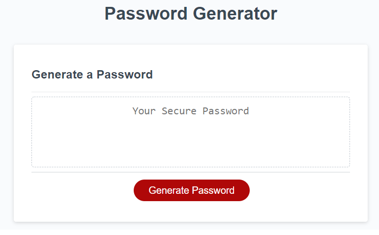
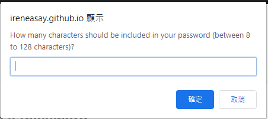

# Random Password Generator

## What is the purpose of this project? 

This is an application that an employee can use to generate a random password based on the criteria they have selected. This application will run in the browser, and will feature dynamically updated HTML and CSS powered by JavaScript code. 

## How to achieve my goal?

I defined different password criteria (e.g. lower or upper case, special characters, numbers) and asked the user to choose at least one of the given criteria. If the user does not choose at least one character type, the user will be alerted to reselect the criteria by generating the password again. The user will also able to set the password length by choosing between 8 to 128 characters. If the user enter a non-numerical value, the value is smaller than 8 or bigger than 128, the user will be promoted to enter an appropriate number in the given range. Once the selected criteria is pulled in the array, a password will be randomly generated from the randomIndex I defined. The final password will be joined as a set of string based on the password criteria given by the user.

## Challenges

It took me a while to map out the app logic and behavior assuming a user type in non-numerical values or numbers outside the given range in **defining the password length**. Another challenge I had was defining the **Math.random** correctly, so a password will be generated randomly based on the user selected criteria.

## Credits

The initial codes are provided by Trilogy Education Services, a 2U, Inc. brand.

## License

© Irene Asay. All Rights Reserved. Under the [MIT/](./license.txt) license.
